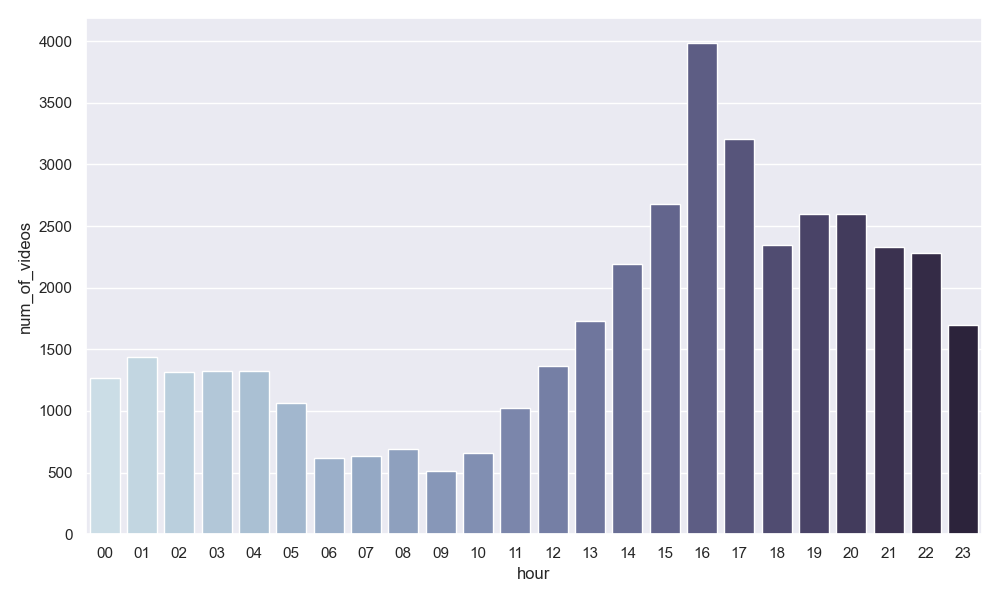
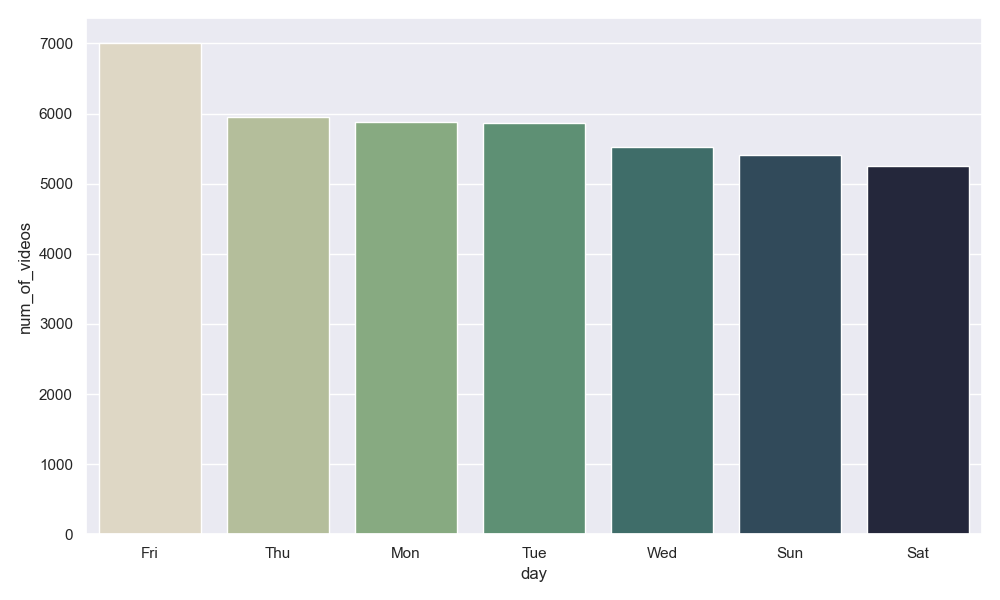

# Youtube-Data-Analysis
Exploratory Data Analysis (EDA) of Youtube trending Dataset.

### Context
YouTube (the world-famous video sharing website) maintains a list of the top trending videos on the platform. According to Variety magazine, “To determine the year’s top-trending videos, YouTube uses a combination of factors including measuring users interactions (number of views, shares, comments and likes). Note that they’re not the most-viewed videos overall for the calendar year”. Top performers on the YouTube trending list are music videos (such as the famously virile “Gangam Style”), celebrity and/or reality TV performances, and the random dude-with-a-camera viral videos that YouTube is well-known for.

This dataset is a daily record of the top trending YouTube videos.

Note that this dataset is a structurally improved version of this dataset https://www.kaggle.com/datasnaek/youtube.

### About the Dataset
This dataset includes several months (and counting) of data on daily trending YouTube videos. Data is included for the US, GB, DE, CA, IN, and FR regions (USA, Great Britain, Denmark, Canada, India, and France, respectively), with up to 200 listed trending videos per day.

Each region’s data is in a separate file. Data includes the video title, channel title, publish time, tags, views, likes and dislikes, description, and comment count.

The data also includes a category_id field, which varies between regions. To retrieve the categories for a specific video, find it in the associated JSON. One such file is included for each of the five regions in the dataset.

### Acknowledgements
This dataset was collected using the YouTube API.

# Analysis of Trending Videos from "CANADA" Region

## Visualization

Distribution of the dataset according to Year ...

this dataset is collected in 2017 and 2018,
( 2018 : 0.765368 
2017 : 0.234632 )

23% of videos are from 2017
77% of videos arefrom 2018

As we can see in Canada "Entertainment" category has maximum trending videos with approx 13500 videos, followed by "News & Politics" and "People & Blogs", which have average number of videos are trending with approx 4000 videos. And the lowest number of trending video category was "Movies", "Shows", etc with less than ~300 videos

### Category vs Parameters ..

### Category vs parameters .. in the year of 2017

### Category vs parameters .. in the year of 2018

### Time Parameters

### 20 Popular Channels in Canada

As we can see the 20 most Trending Channel in which, "SET India", "MSNBC", and "FBE" are in top with approx more than 185 videos.
And "The View" and "Late Night With Seth Meyers" are in the 19th and 20th position with less than 150 videos.

### Correlation between variables ..

From the correlation matrix we can see that likes and views are highly correlated with the value of 0.83 and likes and comment_count are highly correlated with the value of 0.84.
To See wheather the Correlation matrix is correct or not, we can plot Scatter plot for verification ..

Let's see the other scatter plots ..

Let's the relation between views and likes, dislikes, and comment count according to the year ..
### 2017

### 2018

### Lets see the Distribution of likes, Dislikes, views, and comment_counts
As the data is too much skewed, hence I applied Log Transformation of the data, so that we can have good insights ..

### Wordcloud
Let's see which words are used most in tittle and tags..

### Title

From the Wordcloud we can see the most used words used in title are "FUll", "Video", "Episode", "Official", "New", "Game", etc.

### Tags

From the Wordcloud we can see the most used words used in tags are "Food", "Video", "song", "Show", "Funny", "New", "Game", etc.

############################################################################################################################################################################
############################################################################################################################################################################

# Analysis of Trending Videos from "DENMARK" Region

## Visualization

Distribution of the dataset according to Year ...

this dataset is collected in 2017 and 2018,
( 2018 : 0.765368 
2017 : 0.234632 )

23% of videos are from 2017
77% of videos arefrom 2018

As we can see in Denmark "Entertainment" category has maximum trending videos with approx 15000 videos, followed by "News & Politics" and "People & Blogs", which have average number of videos are trending with approx 6000 & 3000 videos respectively. And the lowest number of trending video category was "Movies", "Shows", etc with less than ~300 videos

### Category vs parameters .. in the year of 2017

### Category vs parameters .. in the year of 2018

### Time Parameters

### 20 Popular Channels in Canada

As we can see the 20 most Trending Channel in which, "SET India", "MSNBC", and "FBE" are in top with approx more than 185 videos.
And "The View" and "Late Night With Seth Meyers" are in the 19th and 20th position with less than 150 videos.

### Correlation between variables ..

From the correlation matrix we can see that likes and views are highly correlated with the value of 0.83 and likes and comment_count are highly correlated with the value of 0.84.
To See wheather the Correlation matrix is correct or not, we can plot Scatter plot for verification ..

Let's see the other scatter plots ..

Let's the relation between views and likes, dislikes, and comment count according to the year ..
### 2017

### 2018

### Lets see the Distribution of likes, Dislikes, views, and comment_counts
As the data is too much skewed, hence I applied Log Transformation of the data, so that we can have good insights ..

### Wordcloud
Let's see which words are used most in tittle and tags..

### Title

From the Wordcloud we can see the most used words used in title are "FUll", "Video", "Episode", "Official", "New", "Game", etc.

### Tags

From the Wordcloud we can see the most used words used in tags are "Food", "Video", "song", "Show", "Funny", "New", "Game", etc.
